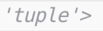
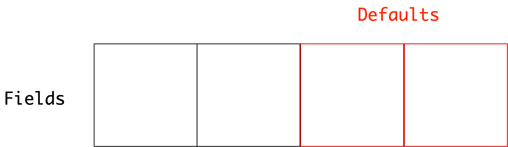

# [fit] What the struct?!

---

`> whoami`

---

- Director, AI Engineering @ S&P Global
- Python fanatic
- New dad

---

---

`struct`

---

`C`

- minimal programming language, came after `B`
- procedural, no objects!

---

---

---

---

---

---

---

# structure++
# readability ++
# reusability ++

---

# Aside: structs and memory

 

- C variables are stored in specific memory addresses
- Using a struct, you can ensure that addresses for the _elements_ in the struct are at contiguous locations in memory
- You can then read and write the struct in binary as a single unit

---

# [fit] Python: `struct`

---

`struct`

 

- Python module for unpacking and repacking structs stored as binary data
- Only useful for high-performance code and interoperating with C
- Requires declaring format types

---

---

---

---

---

---

---

---

---

---

---

---

---

---

---

---

# [fit] what the struct

---

---

---

# [fit] namedtuple

---

`collections.namedtuple`

 

> It's a tuple, with names!

---

---

---

`namedtuple(typename, field_names)`

 
 

- Creates a subtype of `tuple` named `typename`
- Inherits all tuple methods
- Gives named attribute access to fields in tuple

---

# Still a tuple

 

...still immutable
...same memory footprint (no `dict`)
...compares equally to `tuple`

---

---

---

---

---

# Default values

---

---

---

---

---

---

# [fit] dict conversion

---

---

# [fit] Immutability

---

---

`AttributeError`

---

# [fit] tuples are immutable

---

`namedtuple._replace()`

---

---

# What about types?

---

`typing.NamedTuple`

---

`typing.NamedTuple`

 

- Introduced in Python 3.6
- Provides structural subclass of `tuple` with typed fields
- Introduces class-based declaration syntax

---

---

# Subclass syntax

---

---

---

# Sanity

---

# Comparison with tuple

---

---

---

# Immutability

---

---

`AttributeError: can't set attribute`

---

# When to use named tuples?

 

- To add structure to processed immutable records
- To give descriptive names in compound data types
- To get rid of "magic numbers" (indices)

---

When to use `typing.NamedTuple` over `collections.namedtuple`?

 

 

- Basically all the time
- Or, at least when you're working in a typed codebase

---

When to use `typing.NamedTuple` over `collections.namedtuple`?

 

 

- Basically all the time
- Or, at least when you're working in a typed codebase
- (also please work in typed codebases)

---

Exiting tuple-land

---

`dataclasses`

---

`dataclasses`

 

- Introduced in Python 3.7
- Shorthand for creating lightweight classes
- Create independent types, no relation to tuples

---

---

---

No `AttributeError`!

---

---

`TypeError: 'Student' object is not subscriptable`

---

- Mutable by default
- Not subscriptable
- Just plain classes

---

---

# Comparison with tuple

---

---

---

# [fit] Emulating immutability

---

---

`FrozenInstanceError: cannot assign to field 'x'`

---

_"Emulating"_

---

---

`dataclasses` `==` `python objects`

---

`dataclasses` `==` `python objects`

 

`tuples` `==` `C artifacts`

---

If you want a simple tuple, use typing.NamedTuple

 

If you want a Python object that can grow in complexity, use dataclasses

---

`__post_init__`

---

---

---

# TypedDict

---

`typing.TypedDict`

 

- New in Python 3.8
- Add type hints to dictionary
- Doesn't define new runtime class
- Useful for typecheckers like `mypy`

---

---

When to use `TypedDict`?

 

- When you are processing dictionaries (e.g., JSON)
- When you want to add structure to `Dict` type annotations

---

Exiting the standard library

---

`attrs`

---

`attrs`: `Classes Without Boilerplate`

 

 

- Lightweight syntax for declaring custom types
- Been around since Python 2
- Inspired and consulted on `dataclasses`

---

---

# Validators

---

---

`ValueError: Coordinates must be positive.`

---

Features over `dataclasses`:

 

- Python 2/PyPy support
- Validators
- Converters
- `__slots__`
- and more

---

When to use `attrs`:

 

- You need to support Python 2 (:/)
- You need more advanced features than `dataclasses` can provide
- You want to be on the bleeding edge

---

`pydantic`

---

---

# Validators

---

---

`Must be positive (type=value_error)`

---

`pydantic`

 

- Recent project taking advantage of type annotations
- Strong support for data validation
- Full `dataclasses` api and standard library interoperability

---

`dataclasses` `API`

---

---

`Complex serializations`

---

---

When to use `pydantic`:

 

- When you need powerful data validation
- When you're validating external data through an API
- When you need to deserialize a compound structure
- If you're in a typed codebase :)

---

# [fit] Recap

---

- `C structs`
- `Python structs`
- `collection.namedtuple`
- `typing.NamedTuple`
- `dataclasses`
- `typing.TypedDict`
- `attrs`
- `pydantic`

---

> There should be one-- and preferably only one --obvious way to do it.
-- The Zen of Python

--- 

# [fit] fin
